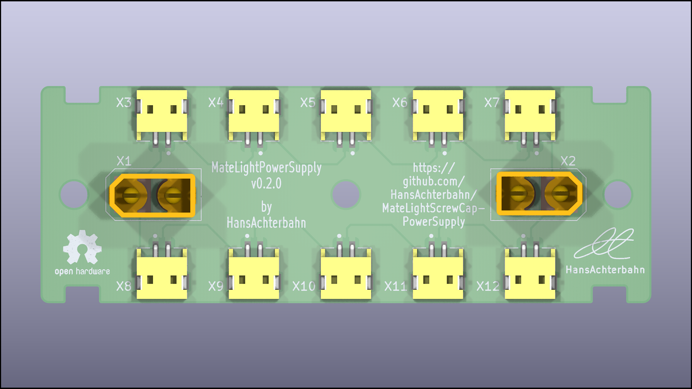
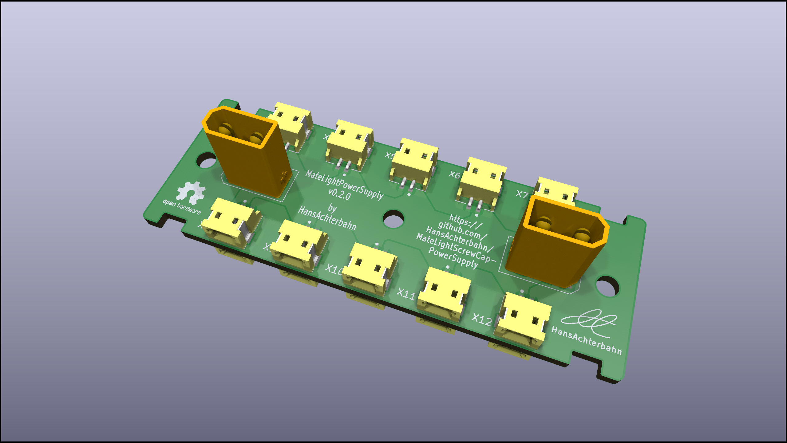
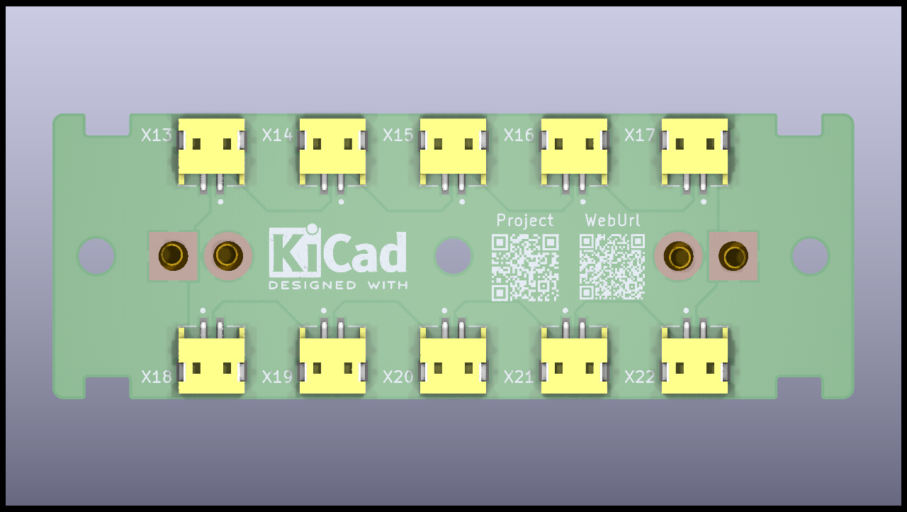
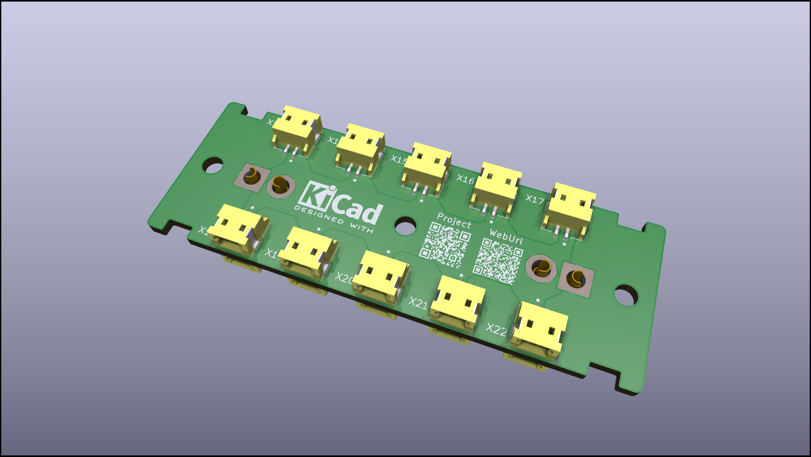
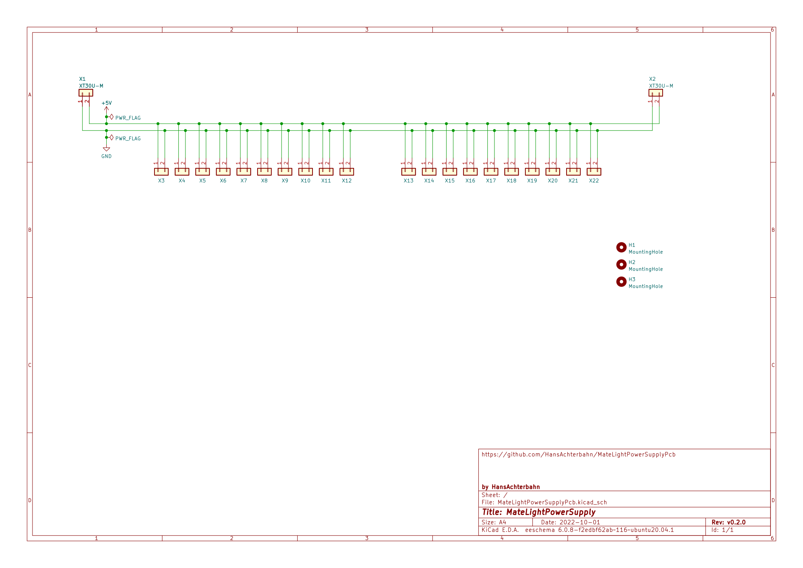
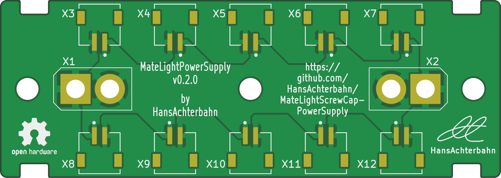
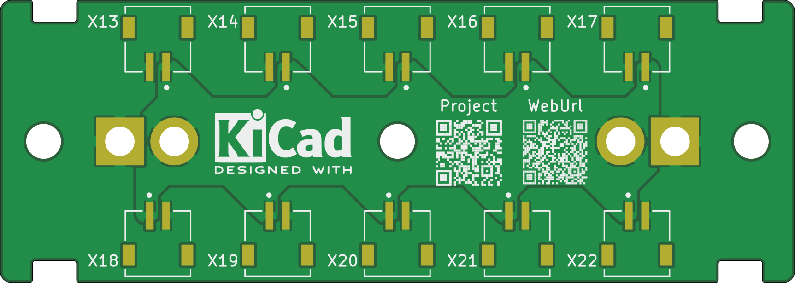

# MateLight-PowerSupply

## Idea

My MateLight project is based on the idea of [jaseg's MateLight](https://github.com/jaseg/matelight) and improves it with a APA102 LED screw cap PCB which is easy to install and easy to remove from the coasters. An overview about my MateLight project you can find on my [MateLight overview page](https://github.com/HansAchterbahn/MateLightScrewCap-PowerSupply).

## This Repo

In this Repository you can find the power distributor for the MateLight coasters (containing 20 bottles).

You can find following details:
- PCB schematics and board layouts (created in Kicad),
- PCB Gerber data (ready for manufacturing),
- a bill of material (with device ordering numbers) and
- a 3D model of the PCB.

*Fork me and have fun!*


## Power source

An APA102C LED consumes a maximum of 60 mA (red/green/blue each 20 mA). Because of that scince v0.2.0 every screw cap has its own power supply. To connect the power supply of every screw cap in a crate you need the power distributor in this repo.

```
                  LED1                                                   LED19                                   LED20
                 (APA102)                                               (APA102)                                (APA102)
                ----------                                             ----------                              ----------
     .--. Clock |   __   | Clock .--.                       .--. Clock |   __   | Clock .--.        .--. Clock |   __   | Clock .--.
     |  |--->---|  /  \  |---> --|  |                       |  |--->---|  /  \  |--->---|  |        |  |--->---|  /  \  |--->---|  |
     |  | Data  | (    ) | Data  |  |          ooo          |  | Data  | (    ) | Data  |  |        |  | Data  | (    ) | Data  |  |
     |  |--->---|  \__/  |--->---|  |                       |  |--->---|  \__/  |--->---|  |        |  |--->---|  \__/  |--->---|  |
     '--'       |        |       '--'                       '--'       |        |       '--'        '--'       |        |       '--'
                ----------                                             ----------                              ---------|
    Input          |  |         Output                     Input          |  |         Output      Input          |  |         Output
  Connector     5V |  | GND    Connector                 Connector     5V |  | GND    Connector  Connector     5V |  | GND    Connector
                  .----.                                                 .----.                                  .----.
                  |    |                                                 |    |                                  |    |
                  '----'                                                 '----'                                  '----'
                  Power                                                  Power                                   Power
                 Connector                                              Connector                               Connector
```

## PCB 3D view

Animated 3D STL model: [kibot/3d/model](https://github.com/HansAchterbahn/MateLightScrewCap-PowerSupply/kibot/3d/model)


__Top view__
<!--



__Top view 30°__
-->


__Bottom view__
<!--


__Bottom view 30°__
-->


## Schematic



## Board

__Top view__



__Bottom view__


